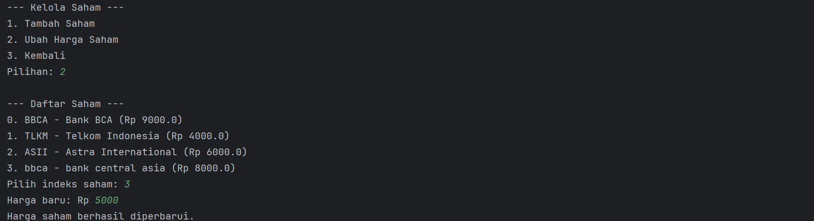

#  Aplikasi Simulasi Investasi Saham & SBN (Java CLI)

Aplikasi berbasis console (CLI) ini memungkinkan pengguna untuk mensimulasikan kegiatan investasi di pasar modal, khususnya untuk pembelian dan penjualan **saham** serta pembelian dan simulasi keuntungan dari **Surat Berharga Negara (SBN)**. Program ini membedakan antara **Admin** dan **Customer**, dengan fitur yang disesuaikan.

---
## UML

---
### Bagian Admin

- **Login**: Bagian login untuk admin.
---

- **Tambah Saham**: Menambahkan saham baru ke dalam daftar.
---

- **Ubah Harga Saham**: Mengubah harga saham yang telah terdaftar.
---

- **Tambah SBN**: Menambahkan Surat Berharga Negara beserta detailnya.
---
### Bagian Customer

- **Login**: Bagian login untuk costumer.
---

- **Beli Saham**: Membeli saham yang tersedia berdasarkan jumlah lembar.
---

- **Jual Saham**: Menjual sebagian atau seluruh saham yang dimiliki.
---

- **Beli SBN**: Membeli Surat Berharga Negara berdasarkan kuota nasional yang tersedia.
---

- **Simulasi SBN**: Menampilkan simulasi kupon bulanan berdasarkan investasi.
---

- **Lihat Portofolio**: Menampilkan portofolio saham & SBN beserta nilai pasarnya.